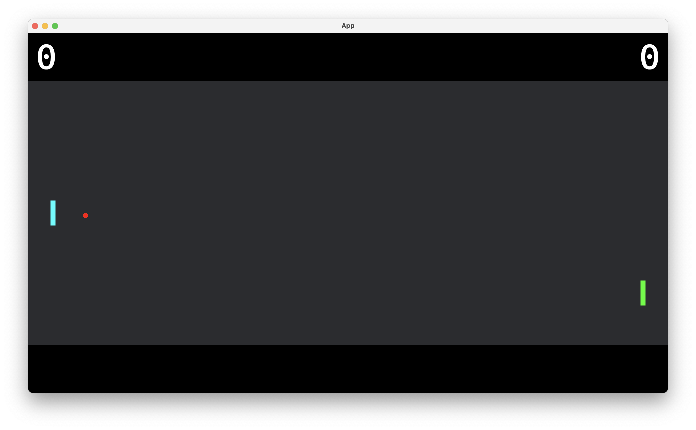

# Pong in Bevy!



This project follows [this](https://taintedcoders.com/bevy/tutorials/pong-tutorial) tutorial to learn the [Bevy](https://bevyengine.org/) framework and its [ECS pattern](https://bevyengine.org/learn/quick-start/getting-started/ecs/) by building a Pong game.

## Basic Concepts

- **Entities**: Fundamental game objects
- **Components** : Data associated with entities
- **Systems**: Logic that operates on entities and components
- **Queries**: Retrieving entities based on their components
- **Events**: Handling interactions and game logic
- **Resources**: Global shared data

## Getting Started

Run the following command:

```sh
cargo run
```

**Note**: Make sure you have Rust installed.
